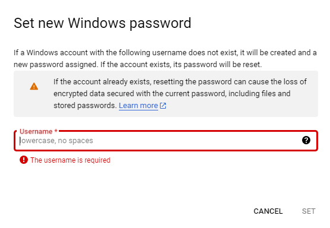
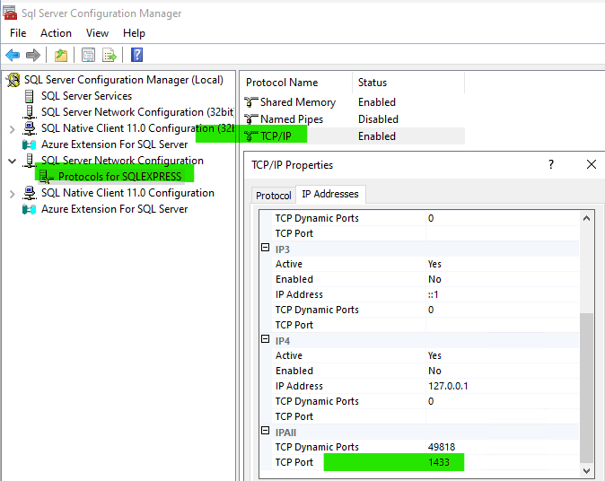
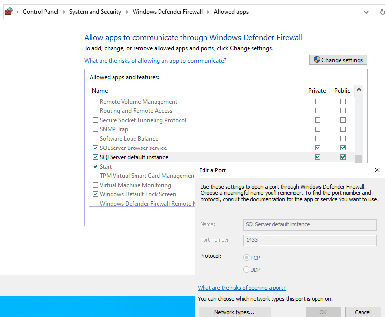
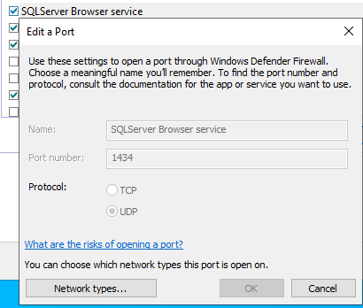
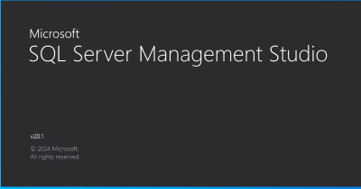
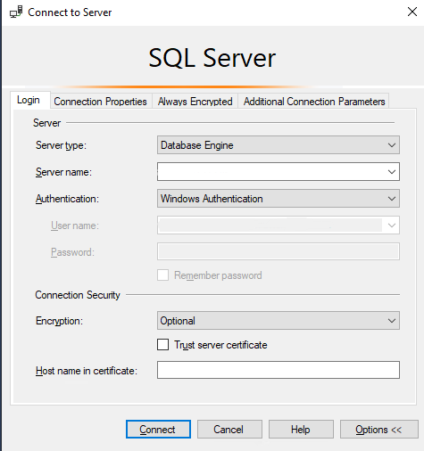
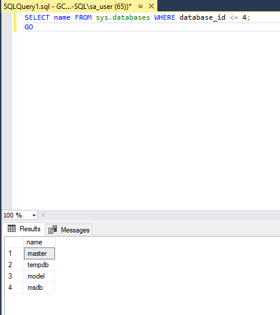

# SQL Server 2019 Express on Windows Server 2019 Datacenter

## Quick Start Guide

Welcome to SQL Server 2019 Express on Windows Server 2019 Datacenter! This guide will help you get started with your new SQL Server Express instance on Google Cloud Platform

### Table of Contents

- [SQL Server 2019 Express on Windows Server 2019 Datacenter](#sql-server-2019-express-on-windows-server-2019-datacenter)
  - [Quick Start Guide](#quick-start-guide)
    - [Table of Contents](#table-of-contents)
    - [Introduction](#introduction)
      - [Key Features](#key-features)
      - [SQL Patch Level](#sql-patch-level)
    - [Prerequisites](#prerequisites)
    - [Installation](#installation)
  - [Before You Get Started](#before-you-get-started)
    - [Enabling TCP/IP Protocol](#enabling-tcpip-protocol)
      - [To set a TCP/IP port for a named instance:](#to-set-a-tcpip-port-for-a-named-instance)
    - [Named Instance](#named-instance)
    - [Firewall](#firewall)
  - [Connecting to SQL Server via SSMS](#connecting-to-sql-server-via-ssms)
  - [Connecting to SQL Server via sqlcmd](#connecting-to-sql-server-via-sqlcmd)
  - [Authentication](#authentication)
  - [Testing the Installation](#testing-the-installation)

### Introduction

This guide provides step-by-step instructions to quick start with SQL Server 2019 Express on Windows Server 2019 Datacenter at Google Cloud Platform.
You will have following within this bundle:
#### Key Features
| Feature                      | Description                                          |
|------------------------------|------------------------------------------------------|
| OS version                   | Microsoft Windows Server 2019 Datacenter (10.0.17763)|
| SQL Package                  | Microsoft SQL Server 2019                            |
| SQL Edition                  | Express                                              |
| Type                         | RTM-CU27 (KB5037331)                                 |
| Version                      | 15.0.2000.5                                          |
| Patch Level                  | 15.0.4375.4                                          |
| Features                     | Database Engine Services, SQL Browser                |
|                              | SQL Writer, SQL Client Connectivity SDK              |
| Named Instance               | SQLEXPRESS                                           |
| Clustered                    | No                                                   |
| SSMS                         | 20.1
#### SQL Patch Level
KB5037331 - Cumulative Update 27 for SQL Server 2019
This update contains 13 [fixes](https://learn.microsoft.com/en-us/troubleshoot/sql/releases/sqlserver-2019/cumulativeupdate27#improvements-and-fixes-included-in-this-update) that were issued after the release of SQL Server 2019 Cumulative Update 26, and it updates components in the following builds:

SQL Server - Product version: 15.0.4375.4, file version: 2019.150.4375.4

[Learn more](https://learn.microsoft.com/en-us/troubleshoot/sql/releases/sqlserver-2019/cumulativeupdate27)

### Prerequisites

- A Google Cloud Platform account.
- Basic knowledge of SQL Server

### Installation

1. **Deploy the Image**: Follow the instructions on the [Google Cloud Platform Marketplace](https://console.cloud.google.com/marketplace/product/gclouds-public/sql-server-2019-express-on-windows-server-2019-datacenter?project=gclouds-public) to deploy the SQL Server 2019 Express image.
2. **Access the SQL Server as an Administrator**: Once the deployment is complete, access your Windows Server instance using Remote Desktop Protocol (RDP) with an administrator user.

 ***Create a Windows administrator user on the server by setting a password.***



## Before You Get Started
Before you can connect to your SQL Server instance from another machine, you will need to complete the following tasks:
- Set default port TCP/IP protocol for the named SQL Server instance
- Create firewall rules for the required ports
- Create the necessary logins for SQL Server

### Enabling TCP/IP Protocol
TCP/IP server network protocol is required to connect to this SQL Server instance from a remote machine. This requires enabling TCP/IP protocol for the SQL Server service. It has been already enabled on the deployed server.

#### To set a TCP/IP port for a named instance:

1. In SQL Server Configuration Manager, in the console pane, expand SQL Server Network Configuration.
2. In the console pane, click Protocols for `SQLEXPRESS`.
3. In the details pane, TCP/IP protocol properties, IP Addresses, IPAll TCP Port: `1433`

1. In the console pane, click SQL Server Services.
2. In the details pane, right-click SQL Server (`SQLEXPRESS`), and then click Restart, to stop and restart the SQL Server service.

### Named Instance
A named instance of SQL Server ( `<host name> ` \ `SQLEXPRESS`) uses dynamic ports.
Because SQL Express is installed then you will need to create a firewall rule for UDP port 1434 as this is the port required by named instances of SQL Server Browser Service to locate the instance on the host.

### Firewall
To access an instance of the SQL Server through a firewall, you must configure the firewall on the computer that is running SQL Server to allow access. The firewall is a component of Microsoft Windows. You can also install a firewall from another company.

You could use the `Powershell` to create the necessary exceptions to allow connections to the SQL Server instance.

An example of a command allowing the named instance TCP port of 1433 to be used is shown below.

```powersehll
New-NetFirewallRule -DisplayName "SQLServer SQLEXPRESS named instance" -Direction Inbound -LocalPort 1433 -Protocol TCP -Action Allow
New-NetFirewallRule -DisplayName "SQLServer Browser service" -Direction Inbound -LocalPort 1434 -Protocol UDP -Action Allow
```


## Connecting to SQL Server via SSMS

1. **Open SQL Server Management Studio (SSMS)**: Launch SSMS on the server as an Administrator.

1. **Connect to the Server**:
   - **Server Name**: Use the IP address or the hostname of your Windows Server instance.
   - **Authentication**: Choose the Windows Authentication method
   - 
2. **Verify the Connection**: Ensure that you can connect to the `SQLEXPRESS` instance
3. **Execute a sample SQL Query**
```cmd
SELECT name FROM sys.databases WHERE database_id <= 4;
GO
```


## Connecting to SQL Server via sqlcmd

1. **Open a command prompt.**: Launch cmd on the server as an Administrator.
2. **Change Directory.**: C:\Program Files\Microsoft SQL Server\Client SDK\ODBC\170\Tools\Binn>
3. **Run sqlcmd prompt**:Enter sqlcmd to start the SQL command-line tool. 
    At the sqlcmd prompt (1>), type the following query and press Enter:
```cmd
SELECT name FROM sys.databases WHERE database_id <= 4;
GO
```
***Output***
```cmd
name                                                                                                                    
--------------------------------
master                                                                                                                  
tempdb                                                                                                                  
model                                                                                                                   
msdb                                                                                                                    

(4 rows affected)
```
## Authentication
As part of this packaged installation, the account running the SQL Server setup `BUILTIN\ADMINISTRATORS` has system administrator (sysadmin) privileges on the SQL Server. In case you need to add another Windows user as a system administrator, then this can be done using the following example.

```sql
CREATE LOGIN [<domainName>\<loginName>] FROM WINDOWS;
GO
ALTER SERVER ROLE sysadmin ADD MEMBER [<domainName>\<loginName>];
GO
```
## Testing the Installation

To verify that SQL Server is running correctly, you can perform the following tests:

1. **Check SQL Server Services**: Ensure that the SQL Server is running. SQL Server Browser services is disabled.
2. **Run a Simple Query**: Open SSMS and run a sample query to test the connection and functionality:
   ```sqlcmd
     SELECT @@VERSION
     GO
   ```